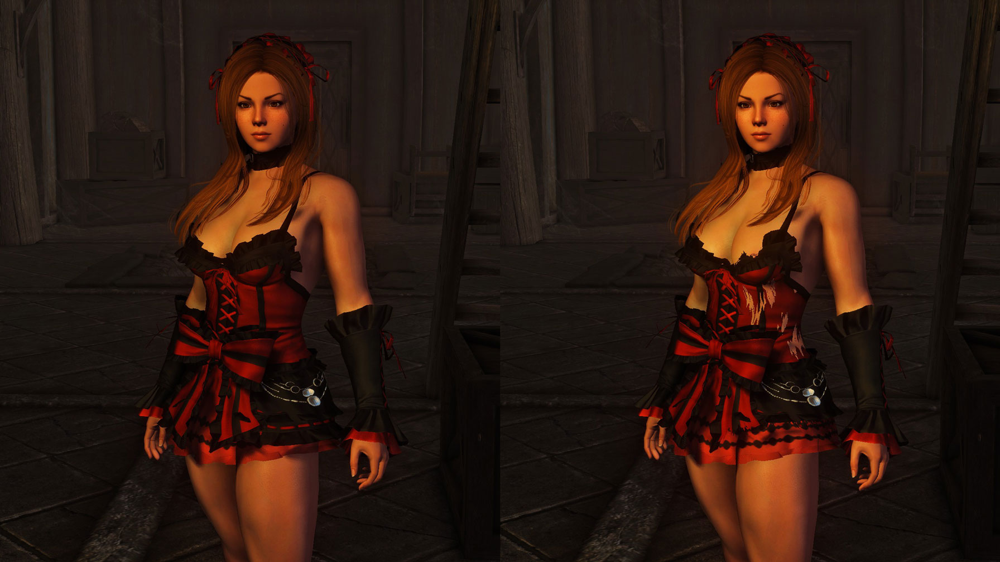
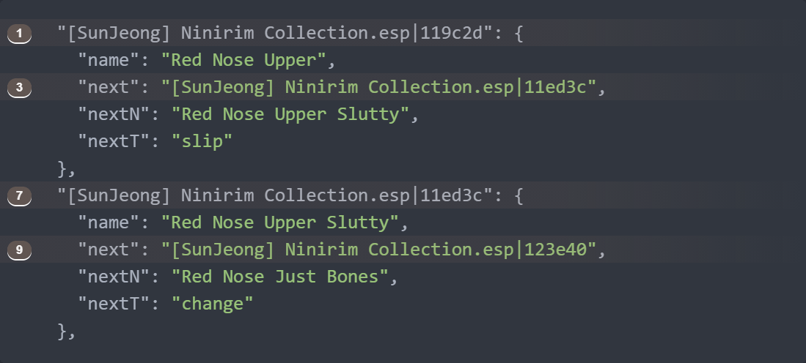
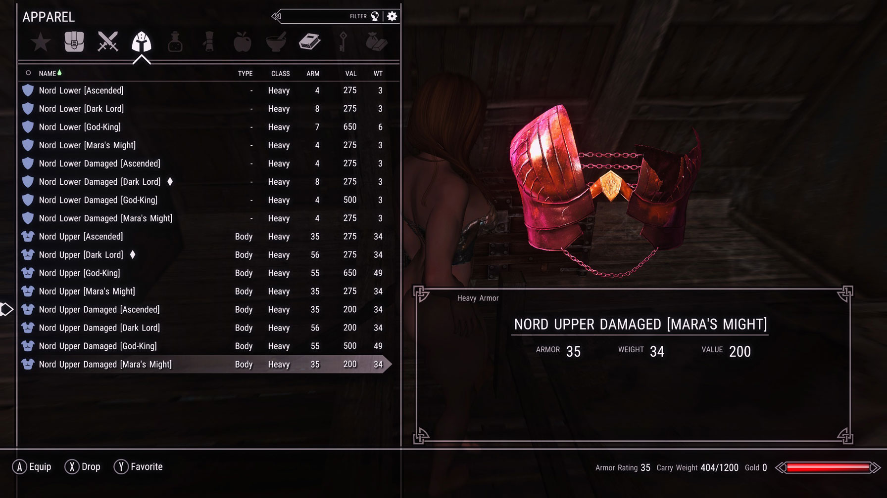
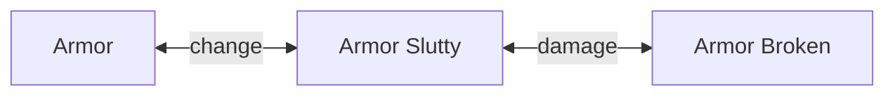

- [Overview](#overview)
- [Features](#features)
- [Usage](#usage)
  - [Using it as a player](#using-it-as-a-player)
  - [Using it as a modder](#using-it-as-a-modder)
- [Warning: heavy reading ahead](#warning-heavy-reading-ahead)
- [Developer mode](#developer-mode)
- [Change Relationships](#change-relationships)
  - [`slip`](#slip)
  - [`change`](#change)
  - [`damage`](#damage)
    - [Skip this if you are not a programmer!](#skip-this-if-you-are-not-a-programmer)
  - [Relationship chains](#relationship-chains)
    - [A real life example](#a-real-life-example)
  - [Understanding API calls](#understanding-api-calls)
- [Configuration files](#configuration-files)
  - [Armor identity solving](#armor-identity-solving)
- [Automatically registering armors](#automatically-registering-armors)
  - [In depth explanation of how it setups relationships](#in-depth-explanation-of-how-it-setups-relationships)
- [Manual mode](#manual-mode)
- [Known issues](#known-issues)
  - [It will delete custom armor enchantments](#it-will-delete-custom-armor-enchantments)
  - [There will be some hiccups](#there-will-be-some-hiccups)

# Overview

We all love armors with skimpy or damaged variants, but there's no other way to really use them but to go to your items menu and then equip them manually to simulate things happening while playing... until now.

This framework enables modders to make mods that automatically swap to those variants, so the player can concentrate on what really matters: playing.

This framework is the result of an idea that have been floating around my mind for many years: having [wardrobe malfunctions][Wardrobe Malfunction] and broken armors while playing.

But that it wasn't really feasible because of Papyrus' hilarious slowness and sorry clunkiness.
It's just now that [Skyrim Platform][] exists that this idea was finally able to come true.

  !!!warning
    Before using this framework, please be ware [there are some limitations][KnownIssues] I can do nothing about.

# Features

Things we owe to [Skyrim Platform][]:

- Fast.
- Easy to use... because Typescript.
- Can enter [developer mode][DeveloperMode] without needing to restart the game.
- Armor registering can be done while playing.
  No need to go to xEdit to generate configuration files.

Features of the framework itself:

- It works for both men[^MenTheory] and women.
- It doesn't care about how armors are named.
- It doesn't care about which body replacements you are using.
- Works on any single type of armor there is: cuirasses, boots, gauntlets, panties...

[^MenTheory]: ... at least theoretically, since I don't know about male armors that have variants that can be exploited by this framework.

# Usage

There are two basic usages of the framework.

1. As a player.
2. As a modder.

## Using it as a player
[Go here][JsonCfgFiles] and download all the files you need for the mods you have, then pray those files work.

If your mod of choice isn't there or any of the configuration files don't work, then you will use this framework as a modder.

## Using it as a modder

These are the basic steps:

- Enable [_developer mode_][DeveloperMode] in `Data\Platform\Plugins\skimpify-framework-settings.txt`.
- Either:
  - Register armors one by one using provided hotkeys.
  - Try your luck and use _automatic mode_ to let the framework try to guess which armors to register.
- Use hotkeys to test and confirm everything is as expected.
- Export your settings to json.
- Give a quick glance at each of the generated files to see if things are as expected.
  If they aren't you can manually change those files in your text editor, if you want.

All this help file is dedicated to guiding you through those steps.

# Warning: heavy reading ahead

What a damn shame is to be warning people that they are required to read, but we are in the 20's, what should I expect?

If you don't like to read, tough luck.
You will need until someone else wants to do a video on how to use this framework or something.

I hate videos, so don't ever expect me to be that guy.
... and you hope this really gets people interested in it, so someone is willing to do a video.

Otherwise, suck it up and learn how to read.

# Developer mode

Go to `Data\Platform\Plugins\skimpify-framework-settings.txt` and change this:

```json
"developerMode": true
```

Thanks to [Skyrim Platform][] magic, you can change that while playing the game and it will totally switch without hassle.

  !!!warning If you are using Mod Organizer...

    It doesn't matter where you put `Platform\Plugins\skimpify-framework.js`, but if you want this feature of automatically applying settings while running the game[^SpHR] to be present, **you must put `skimpify-framework-settings.txt` in `overwrite\Platform\Plugins`**.

    Yeah, you read it right.
    Plugin settings files go into your `overwrite` folder if you want to change settings while playing.

    This is valid not just for this [Skyrim Platform][] plugin, but every single one.

[^SpHR]: Called [Hot Reload][SPHotReload].

When _developer mode_ is active, a plethora of hotkeys for using different functions[^Suggestions] are now available to you.

- File related functions.
  - Save all registered armors to configuration files.
  - Load all currently installed [configuration files][JsonCfgFiles].
- Functions for registering and testing armors.
  - [Automatically registering armors][AutoGen].
  - Manually registering the currently equipped armor.
    - Clear all relationships.
    - Mark for relationship.
    - Add as a skimpy version with a `slip` type of [_Change Relationship_][ChangeRels].
    - Add as a skimpy version with a `change` type of _Change Relationship_.
    - Add as a skimpy version with a `damage` type of _Change Relationship_.
  - Testing armors.
    - Unequip all armors.
    - Swap all equiped armors to their next skimpy version.
    - Swap all equiped armors to their next modest version.
    - Tell which armors are related to the currently equipped one.

All these functions are meant to be used only when registering and debugging armors and not for normal gameplay, of course.
So, after you are done you should always deactivate it by using.

```json
"developerMode": false
```

[^Suggestions]: All these are functions I found out to be useful while registering my own installed mods.
If you have an idea of a function that can speed up things, I'm willing to hear it.

# Change Relationships

You will see the words _Change Relationship_ quite a lot both here and the API documentation.
Since this is the most basic premise of this framework, let's start the real meat of this help file by explaining it.

Some armors have damaged versions, others are more like nipple/pussy slips and yet others are armor variants with missing parts (but not damaged per se).
A _Change Relationship_ tells precisely that: what happens when an armor changes to another.


These relationships exist because in your mod you may want to know what happens when you change an armor for other.

This framework was born from the necessity of managing armor changes for my [Wardrobe Malfunction][] mod. It wouldn't make sense to break an armor on sneaking, then automatically restore it after exiting sneaking; something that can be reasonable done for a nipslip, for example.


At any rate, now we will see each type of _Change Relationship_ there is and some pictures, because all this stuff is is easier to explain with pictures.

## `slip`


The new `Armor` is basically the same, but moved/open to be revealing.

An unbuttoned bra or open shirt is also a good candidate to be registered as this type.


... you get the idea...

This is the most subtle kind of change and one that can be done periodically with no _muh immersion_ repercusions.

[Wardrobe Malfunction][] by default uses a relatively high probability of these happening while sneaking, when sprinting, when swimming... as a modder, you can use these quite liberally and players won't complain of it being too unrealistic.

Restoring the armor back to normal means an `Actor` just adjusted their clothes.

## `change`


The `Armor` has structural changes, like missing parts.


Notice how the armor isn't really broken or damaged; it's just that it has some missing parts (both for the skirt and cuirass in the first picture).

[Wardrobe Malfunction][] uses this kind of _Change Relationship_ to **represent**[^Imagination] parts of the armor falling in the heat of the battle.
That is meant to represent an `Actor` losing pieces of armor and then putting them back **only when possible**.

[^Imagination]: At some point you just need to use your imagination.

This is the most common variant found on armors, by the way. That's why everything, from [automatic generation][AutoGen] to improperly registered _Change Relationships_ default to this value.

## `damage`


The `Armor` has structural changes that makes it look damaged or worn out.




[Wardrobe Malfunction][] uses these kind of _Change Relationships_ to break armors in combat.
You can use these for some rape scene I know you will totally use this framework for, you predictable bastard[^Rape].

[^Rape]: In fact, I could wager the first mod to use this framework after Wardrobe Malfunction will be some kind of rape or slavery mod.

By its nature, obviously this kind of change shouldn't be automatically restored by your mod, otherwise it will just look dumb.
That's unless you add an armor repair mechanic, of course.

The aformented Wardrobe Malfunction never restores these kind of changes for _muh immersion_ purposes.

### Skip this if you are not a programmer!

Notice that the framework itself registers these as both ways relationships, meaning they can be restored.


However, this is how Wardrobe Malfunction uses them:


And it does it simply by refusing to restore an armor back to normal if it finds the _Change Relationship_ with its modest version is `damage`.


```ts
function MostModest(a: Armor): Armor | null {
  const p = GetModestData(a)
  if (!p.armor || p.kind === ChangeRel.damage) return null
  const pp = MostModest(p.armor)
  return pp ? pp : p.armor
}
```

## Relationship chains

Registering an armor can be seen as putting it in a relationship chain with other ones:


Notice I called them "chains" and not "trees", because at the moment it isn't possible to do this:


And it isn't possible because almost all armors can be registered to follow this pattern and it will make total visual sense:


I won't likely add a functionality to have trees instead of chains because it will complicate the code quite a lot for all of us and, from hundreds of armors, **I have found only one** that can be setup like this:


... but if many armor creators start doing things like this, I'll gladly add that functionality.

### A real life example

By the way, as you saw in that last example, not all armors in a relationship chain need to have the same _Change Relationship_.

Here's a real life example of one armor has different kinds of _Change Relationships_ between its variants.
It's from the excelent `[SunJeong] Ninirim Collection.esp`.


There is no theoretical limit to how long a chain can be. That's all up to armor creators.

... most of the time it will have only two elements, though.


## Understanding API calls

As you have seen in most diagrams, they usually go this way:


That's is exactly why functions were named _"ModestThis"_, _"SkimpyThat"_...

You can think about those functions like they deal with things in this order:


"Modest" functions deal with armors before the current one, while "Skimpy" ones deal with whatever comes next in the chain.

# Configuration files

The explanation in their [download page][JsonCfgFiles] is longer than here because that was not the place for talking about relationship chains.
But now that you know more about the inner workings of this framework, it's way easier to understand what these files are for.

Basically they are a way to save these relationship chains to some file, so players can reproduce those chains in their own game.

Let's see an example.
This defines the middle armor relationships in [the chain we saw above](#a-real-life-example):

```json
"[SunJeong] Ninirim Collection.esp|11ed3c": {
  "name": "Red Nose Upper Slutty",
  "next": "[SunJeong] Ninirim Collection.esp|123e40",
  "nextN": "Red Nose Just Bones",
  "nextT": "change",
  "prev": "[SunJeong] Ninirim Collection.esp|119c2d",
  "prevN": "Red Nose Upper",
  "prevT": "slip"
}
```
Since we are only defining one armor, this is a rough visual representation of what those lines are saying:

```sequence
participant Upper
participant Slutty
participant Just Bones
Note over Slutty: 11ed3c
note over Slutty,Just Bones: next
Note over Just Bones: 123e40
Slutty->>Just Bones: change
note over Slutty,Upper: prev
Note over Upper: 119c2d
Slutty->>Upper: slip
```

And this is how the whole chain looks like:

```json
"[SunJeong] Ninirim Collection.esp|119c2d": {
  "name": "Red Nose Upper",
  "next": "[SunJeong] Ninirim Collection.esp|11ed3c",
  "nextN": "Red Nose Upper Slutty",
  "nextT": "slip"
},
"[SunJeong] Ninirim Collection.esp|11ed3c": {
  "name": "Red Nose Upper Slutty",
  "next": "[SunJeong] Ninirim Collection.esp|123e40",
  "nextN": "Red Nose Just Bones",
  "nextT": "change",
  "prev": "[SunJeong] Ninirim Collection.esp|119c2d",
  "prevN": "Red Nose Upper",
  "prevT": "slip"
},
"[SunJeong] Ninirim Collection.esp|123e40": {
  "name": "Red Nose Just Bones",
  "prev": "[SunJeong] Ninirim Collection.esp|11ed3c",
  "prevN": "Red Nose Upper Slutty",
  "prevT": "change"
}
```


## Armor identity solving

Had to take them out from the PDF because they looked like shit, but some lines in the json sample above should had been highlighted:



Those are the kind of lines the framework actually uses for recognizing armors.

The basic structure is:

```mermaid
flowchart LR
    A[Esp file name] o-- separator --> B[Hex FormId]
```

```json
"esp|formId"
```

That's all the framework needs to know for recognizing an armor and that's why if configuration files have different FormIds defined in them than the data your actual game carries, they won't work.

Even the `"prevT"` and `"nextT"` lines (which define the _Change Relationship_ between two armors), can be ommited.
In that case, their relationship will be assumed to be `change`.

!!!info Did you know...?
    When I first started to write this framework, I originally named them _"Change Types"_. That's why those things were named `prevT(ype)` and `nextT(ype)`.

    It was until way later that I settled down to call them _Change Relationships_, but at that point it was too risky to change `"prevT"` and `"nextT"` names to reflect that, since that could be a source of **VERY** hard to track bugs.

    So... just remember this when you wonder why those things aren't named `"prevR"` and `"nextR"`.

All this info is quite useful if you plan to manually modify json files.
For example, sometimes it's way easier to use [automatic generation mode][AutoGen], save those files, then use a text editor to change all relationships to `"slip"`.

At any rate, only a weirdo would create json config files by hand.
That's why there are functions for registering armors while in game.

# Automatically registering armors

This is the first of the ==hotkey based functions== we will learn about.

This mode ***tries*** to automatically set relationships based on armor names.[^ArmorNames]
[^ArmorNames]: This is the only thing armor names are used for.

To use it:

1. Put the armors you want to set relationships for in your inventory.
2. Press the hotkey.
3. ==Test that relationships were setup as expected==.



This mode is quite limited by the fact that armors names don't really follow any kind of covention, so most of the time it will setup relationships as being of type [`change`](#change).
The only single time it will set them up with any other value is if a variant contains the word _"damage"_ or _"damaged"_ (see picture above).

Since you will get a `change` relationship most of the time, you will most probably follow these steps when using this auto function:

1. Automatically register armors.
2. ==Save database to json files==.
3. Manually modify your newly generated [configuration file][ConfigFiles] using some text editor.
4. ==Reload data from json files==, so your changes made in the json file are lodaded into the game.

By the way...

!!!warning
    If this function finds that a _Change Relationship_ was already been stablished between two armors, it won't change it.

## In depth explanation of how it setups relationships

You can skip this part if you like, but it will give you a better insight of what to expect when using this functionality.

As I said, there's no way this function knows what an armor is supposed to represent.

For example, many skimpy variants of armors are named _"slutty"_, but that doesn't say anything at all about what the armor actually looks like.
In practice, it may mean anything: a nipslip, a pussy slip, revealing armor...

So, since the most common variant found is of `change` type, this assumes everything that isn't named _"damage"_ is a `change` type.

How does it know which armors **MAY** be related? By looking at their names.

This is the overall process[^Alogrithm]:

[^Alogrithm]: It took me some tries and some ingenuity to come up with this algorithm. I don't think it will get better than this.

1. First it rearranges the name of all armors based on some list (more on that soon).
2. Then it compares all armors that seem to be related.
3. If some armor on the list has one of the words on the llist I talked about in step 1, it will be marked.

The list I told about is a list of words I know are ususally used to denote skimpy versions.
If an armor name has any of those words on it, it will get sent to the end of the word so it can be more easily compared.

Here's the list; and the automatic registering process will try to find words in this order:

1. slutty
1. slut
1. xtra
2. naked
3. nude
4. topless
5. sex
6. damaged
7. damage
8. broken
9. broke

This how it looks in action (taken from an actual log):

```
[none] ‎29‎/‎11‎/‎2021‎ ‎02‎:‎54‎:‎12‎ ‎a. m.: =================================
[none] ‎29‎/‎11‎/‎2021‎ ‎02‎:‎54‎:‎12‎ ‎a. m.: Generating armors for exporting
[none] ‎29‎/‎11‎/‎2021‎ ‎02‎:‎54‎:‎12‎ ‎a. m.: =================================
[none] ‎29‎/‎11‎/‎2021‎ ‎02‎:‎54‎:‎12‎ ‎a. m.: Armors in inventory:

[none] ‎29‎/‎11‎/‎2021‎ ‎02‎:‎54‎:‎12‎ ‎a. m.: Nord Upper [Dark Lord]
[none] ‎29‎/‎11‎/‎2021‎ ‎02‎:‎54‎:‎12‎ ‎a. m.: [Christine] Nord Ascended.esp|842

[none] ‎29‎/‎11‎/‎2021‎ ‎02‎:‎54‎:‎12‎ ‎a. m.: Nord Upper Damaged [Dark Lord]
[none] ‎29‎/‎11‎/‎2021‎ ‎02‎:‎54‎:‎12‎ ‎a. m.: [Christine] Nord Ascended.esp|844

... etc

[verbose] ‎29‎/‎11‎/‎2021‎ ‎02‎:‎54‎:‎12‎ ‎a. m.: Armor name didn't need preprocess: nord upper [dark lord]

[verbose] ‎29‎/‎11‎/‎2021‎ ‎02‎:‎54‎:‎12‎ ‎a. m.: Armor name was rearranged because it may be a variant
[verbose] ‎29‎/‎11‎/‎2021‎ ‎02‎:‎54‎:‎12‎ ‎a. m.: Original: nord upper damaged [dark lord]
[verbose] ‎29‎/‎11‎/‎2021‎ ‎02‎:‎54‎:‎12‎ ‎a. m.: Rearranged: nord upper [dark lord] damaged

... etc

[verbose] ‎29‎/‎11‎/‎2021‎ ‎02‎:‎54‎:‎12‎ ‎a. m.: Armor name didn't need preprocess: [coco]assassin_corset1

[verbose] ‎29‎/‎11‎/‎2021‎ ‎02‎:‎54‎:‎12‎ ‎a. m.: Armor name was rearranged because it may be a variant
[verbose] ‎29‎/‎11‎/‎2021‎ ‎02‎:‎54‎:‎12‎ ‎a. m.: Original: [coco]assassin_corsetsex1
[verbose] ‎29‎/‎11‎/‎2021‎ ‎02‎:‎54‎:‎12‎ ‎a. m.: Rearranged: [coco]assassin_corset1sex

[verbose] ‎29‎/‎11‎/‎2021‎ ‎02‎:‎54‎:‎12‎ ‎a. m.: Armor name didn't need preprocess: [coco]assassin_corset1b

[verbose] ‎29‎/‎11‎/‎2021‎ ‎02‎:‎54‎:‎12‎ ‎a. m.: Armor name was rearranged because it may be a variant
[verbose] ‎29‎/‎11‎/‎2021‎ ‎02‎:‎54‎:‎12‎ ‎a. m.: Original: [coco]assassin_corsetsex1b
[verbose] ‎29‎/‎11‎/‎2021‎ ‎02‎:‎54‎:‎12‎ ‎a. m.: Rearranged: [coco]assassin_corset1bsex
```

As you can see, it found the word `damaged` in `nord upper damaged [dark lord]`, so it send it to the end of the name, ending up with `nord upper [dark lord] damaged`.

Same with:

`[coco]assassin_corsetsex1` &rarr; `[coco]assassin_corset1sex`
`[coco]assassin_corsetsex1b` &rarr; `[coco]assassin_corset1bsex`

Why doing that? Because, as you saw in the log, base armors are named:

```
nord upper [dark lord]
[coco]assassin_corset1
[coco]assassin_corset1b
```

Are you seeing why it's easier for a computer to compare:

```
nord upper [dark lord]
nord upper [dark lord] damaged

[coco]assassin_corset1
[coco]assassin_corset1sex

[coco]assassin_corset1b
[coco]assassin_corset1bsex
```

than:

```
nord upper [dark lord]
nord upper damaged [dark lord]

[coco]assassin_corset1
[coco]assassin_corsetsex1

[coco]assassin_corset1b
[coco]assassin_corsetsex1b
```

?

Yeah, the first version is just the same name but with with some word added at the end of if.

By the way, this renaming stuff is only done for the purpose of finding possible matches.
It won't change your armor name in game. At all.

!!!warning
      Knowing in what order words are searched and how items are renamed is important because if a base armor has a name like `Slutty elf armor` and a broken variant named `Slutty elf damaged armor`, they will be renamed as `elf armor slutty` and `elf damaged armor slutty`.

      ... those names won't be recognized as the same armor because they don't share the same word radix.

Once things are renamed, it tries to find which armors seem to be the same, but with a new word added at the end:

```
[info] ‎29‎/‎11‎/‎2021‎ ‎02‎:‎54‎:‎12‎ ‎a. m.: These armors seem to be variants
[info] ‎29‎/‎11‎/‎2021‎ ‎02‎:‎54‎:‎12‎ ‎a. m.: =================================
[verbose] ‎29‎/‎11‎/‎2021‎ ‎02‎:‎54‎:‎12‎ ‎a. m.: [coco]assassin_corset1
[verbose] ‎29‎/‎11‎/‎2021‎ ‎02‎:‎54‎:‎12‎ ‎a. m.: [coco]assassin_corset1b
[verbose] ‎29‎/‎11‎/‎2021‎ ‎02‎:‎54‎:‎12‎ ‎a. m.: [coco]assassin_corset1sex
[verbose] ‎29‎/‎11‎/‎2021‎ ‎02‎:‎54‎:‎12‎ ‎a. m.: [coco]assassin_corset1bsex

[info] ‎29‎/‎11‎/‎2021‎ ‎02‎:‎54‎:‎12‎ ‎a. m.: *** [coco]assassin_corset1sex is a(n) sex variant

[info] ‎29‎/‎11‎/‎2021‎ ‎02‎:‎54‎:‎12‎ ‎a. m.: [coco]assassin_corset1sex is now registered as a skimpy version of [coco]assassin_corset1. Change type: slip.

[info] ‎29‎/‎11‎/‎2021‎ ‎02‎:‎54‎:‎12‎ ‎a. m.: These armors seem to be variants
[info] ‎29‎/‎11‎/‎2021‎ ‎02‎:‎54‎:‎12‎ ‎a. m.: =================================
[verbose] ‎29‎/‎11‎/‎2021‎ ‎02‎:‎54‎:‎12‎ ‎a. m.: [coco]assassin_corset1b
[verbose] ‎29‎/‎11‎/‎2021‎ ‎02‎:‎54‎:‎12‎ ‎a. m.: [coco]assassin_corset1sex
[verbose] ‎29‎/‎11‎/‎2021‎ ‎02‎:‎54‎:‎12‎ ‎a. m.: [coco]assassin_corset1bsex

[info] ‎29‎/‎11‎/‎2021‎ ‎02‎:‎54‎:‎12‎ ‎a. m.: *** [coco]assassin_corset1bsex is a(n) sex variant

[info] ‎29‎/‎11‎/‎2021‎ ‎02‎:‎54‎:‎12‎ ‎a. m.: [coco]assassin_corset1bsex is now registered as a skimpy version of [coco]assassin_corset1b. Change type: slip.

[info] ‎29‎/‎11‎/‎2021‎ ‎02‎:‎54‎:‎12‎ ‎a. m.: These armors seem to be variants
[info] ‎29‎/‎11‎/‎2021‎ ‎02‎:‎54‎:‎12‎ ‎a. m.: =================================
[verbose] ‎29‎/‎11‎/‎2021‎ ‎02‎:‎54‎:‎12‎ ‎a. m.: [coco]assassin_corset1sex
[verbose] ‎29‎/‎11‎/‎2021‎ ‎02‎:‎54‎:‎12‎ ‎a. m.: [coco]assassin_corset1bsex

[info] ‎29‎/‎11‎/‎2021‎ ‎02‎:‎54‎:‎12‎ ‎a. m.: --- No relationship found between elements in this list.
[info] ‎29‎/‎11‎/‎2021‎ ‎02‎:‎54‎:‎12‎ ‎a. m.: Did this framework's author forget to check for some particular word?

[info] ‎29‎/‎11‎/‎2021‎ ‎02‎:‎54‎:‎12‎ ‎a. m.: These armors seem to be variants
[info] ‎29‎/‎11‎/‎2021‎ ‎02‎:‎54‎:‎12‎ ‎a. m.: =================================
[verbose] ‎29‎/‎11‎/‎2021‎ ‎02‎:‎54‎:‎12‎ ‎a. m.: nord lower [ascended]
[verbose] ‎29‎/‎11‎/‎2021‎ ‎02‎:‎54‎:‎12‎ ‎a. m.: nord lower [ascended] damaged

[info] ‎29‎/‎11‎/‎2021‎ ‎02‎:‎54‎:‎12‎ ‎a. m.: *** nord lower [ascended] damaged is a(n) damaged variant
```

Coco Assassin armors were recognized as `slip` because I had already added them to the framework, but the Nord Ascended ones hadn't and were recognized as damaged variants because of their name.

You may be wondering what would happen if you had these armors in you inventory:

```
Armor
Armor Slutty
Armor Broken
```

Well, this is what this function would create:



Yeah... ***as long as armors are named in certain ways, it can automatically create full chains***.

# Manual mode

Automatic generation may be useful under certain conditions, but this will be your bread and butter.

# Known issues

I know about these and it's unlikely I ever get to solve them.

## It will delete custom armor enchantments

... like the ones you create in the enchanting table.

The framework won't do that per se, but mods using it will most likely do.

The root of the problem comes from a well known issue with Skyrim, where **custom enchantments on armors don't get applied when programatically equipping them**.
Ie. if a mod uses code to equip some armor[^AllModsEquip], you can bet your ass the enchantment won't get applied on you.

[^AllModsEquip]: ... and all mods using this framework will do that.

I have a pair of good ideas to make it so armors with custom enchantments can be saved by the framework, believe me.
But as long as this issue is not addressed by some other modder[^BethSucks], it's just not worth my time, since you would need to go to your inventory and manually unequip-reequip your armor, **thus defeating the whole purpose of this framework for existing**.

[^BethSucks]: Because of course it won't be solved by Bethesda. Ever.

But there's a solution to this and I have been using it for some time, by the way: ***Just add the enchantments to an esp patch file*** (`EITM - Object Effect` is the value you care about).


Sure, it will make impossible to change enchantments for some particular armor and requires a bit of work and thought, but this will give you an actual reason to use many of your installed armor mods.

## There will be some hiccups

When changing armors for the first time on your game session or after some time not seeing a variant, there will be a milliseconds freeze while the game loads the model.

Again, there's nothing I can do about this. There's no way I could preload armors and things like that, so things go smooth the first time armors need to be swapped.

Still, it's not that bad.
Once the armor actually gets loaded into memory you can expect changes to be mostly unnoticeable.

[AutoGen]: #automatically-registering-armors
[ChangeRels]: #change-relationships
[DeveloperMode]: #developer-mode
[JsonCfgFiles]: https://github.com/CarlosLeyvaAyala/skimpify-framework/tree/main/SKSE/Plugins/Skimpify%20Framework
[KnownIssues]: #known-issues
[Skyrim Platform]: https://www.nexusmods.com/skyrimspecialedition/mods/54909
[SPHotReload]: https://github.com/skyrim-multiplayer/skymp/blob/main/docs/skyrim_platform/features.md#hot-reload
[Wardrobe Malfunction]: todo
[ConfigFiles]: #configuration-files
